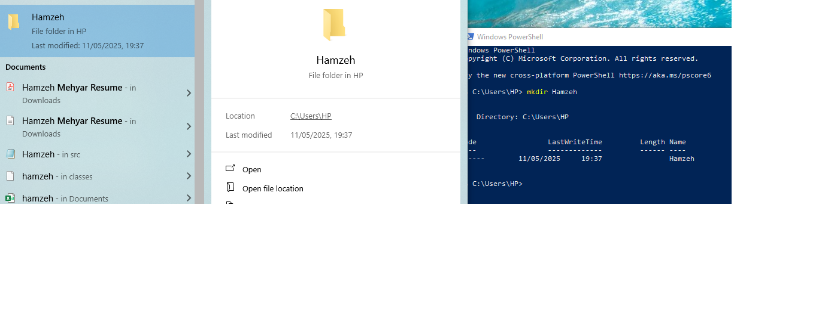
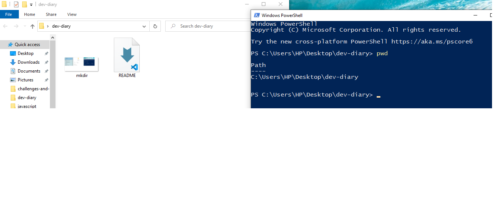
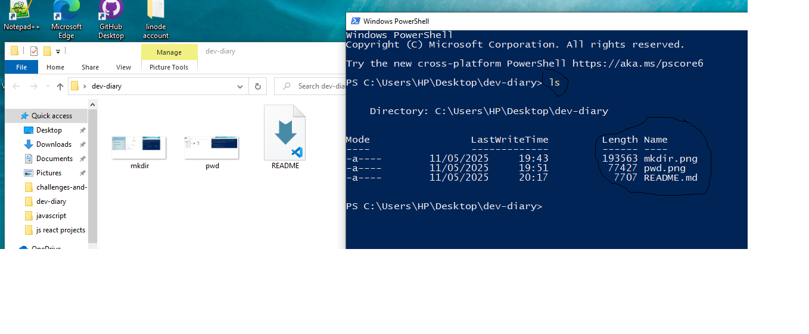
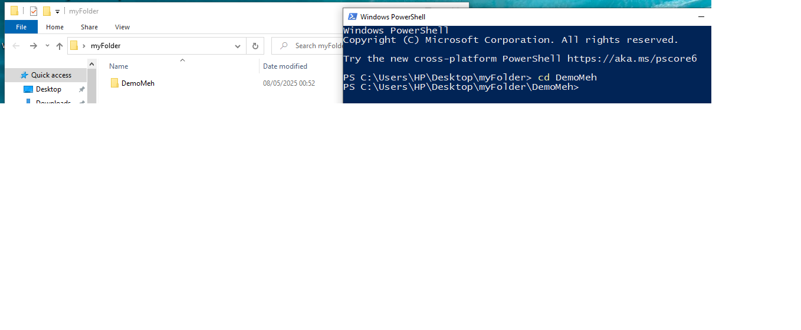
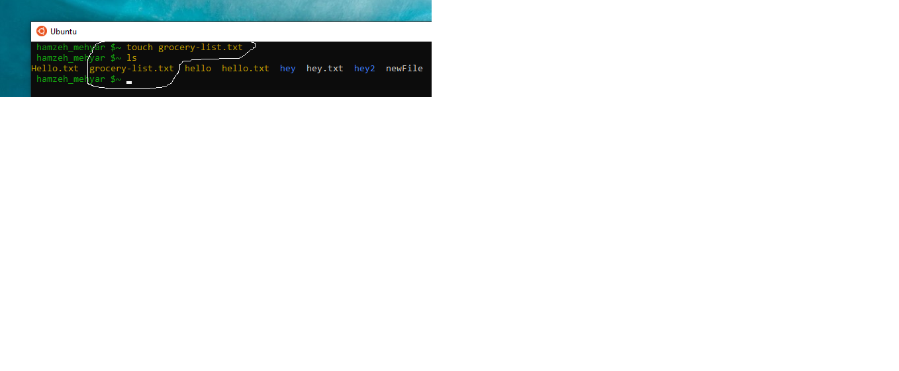

# introduction about myself

      This is Hamzeh Mehyar, Hamzeh is a junior developer that has studied data science & artificial intelligence,
    and willing to grow in the tech industry by being a full stack web developer for finding solutions that help in digital transformation,
    also willing in the future to integrate web development with artificial intelligence.

# what I have learnt from the good developer mindset article

- The technology field keeps **growing** everyday and sometimes you may miss a lot of things, so it's important to keep learning
        to keep up to date with things that are growing rapidly, in the old decades people used to see the future life as a joke,
        like who imagined for an example using video calls to talk with people from another country, and now here we are seeing this technologies, and you as a developer must keep an eye for this growing field.

- Any problem in the world must be divided into small pieces to get solved, so it's like a **divide and qonquer**, let's say you want 
      to build any system you want to build, you have to break this system into functional requirments and start to solve this requirment to another one, step by step, to fully understand where you are, you don't just look at the problem of how big is it, maybe the problem is really big but when you start breaking it into smaller pieces it will get solved.

    - **Debugging and finding problems** is an important skill for every developer, every developer must have a strong logic of how things 
      could be solved, it's okay if sometimes you get stuck, that doesn't mean that you are not good enough or something, it means that after finding the solution you are learning something new that you can easily solve if you same the same problem again in the future, and this gets us back to the first point that you have to keep learning, even fixing bugs is a learning journey.

    - **Growth** is a really deep thing that comes from making mistakes and learning, every code that you write, every line that you write, you
        are nor just typing random code lines that going to be forgot, you are learning by every mistake you make.

    - **focusing on providind values** let's be clear here, you as a developer, are meant to be the one who solves problems for the people,
        by making their life easier, building up solutions that can put people's life in ease, let's say an example, instead of going to the electrcity or water department to pay the bills and stucking at traffic and waiting in lines, you can just make this easier by building a system that can easily solve this issue by paying online, so the user experience is more important than the code itself.

    - **Strive for simplicity in your code and solutions**, always try to make things as simple as could it be and eficient as could it be, 
        don't make your users run away from your system by making your system hard to use for example, make it simple to let the users easily get the maximum benefit they need, also eficiency is very important that could grow with time, when you write your code for example, try to write the most efficient code that meets the requirments and the effieciency.

    - **Priorities**, we as a developers always have things to do, so we have to put these things or structure them if this things is 
        important now or should I make the other things and get back to this problem, you sometimes get confused, so the right way is to structure these problems, there is a way that is mentioned in the article called **Eisenhower Decision Matrix**, this way divides your tasks into four types which are:

        1. Important and urgent

        2. Important but not urgent

        3. Not important but urgent

        4. Not important and not urgent

       and I honestly see this is a smart way of structuring your tasks

    - **Planning for maintenance** when writing a code for the first time or building something new, you must know that this code is 
        for the longterm use, so you don't just write spaggeti code and goodbye, you write a clean code and naming functions in a good way and making clean spaces and writing comments, this helps you and helps other developers if they want to contribute with your code and when you want to edit on a feature or make something more good at the future, writing clean code helps making it easier for future maintenance.

    - **Future needs** every succecfull system is updated regulary, and succescfull systems comes from great developers, they make 
        their code able to be upgraded in the future and structuring components in the right way so everything will be clear when it must be upgraded.

    - **Development process**, we have 2 ways of the software development process or life cycle, as a developer you may choose 
        the waterfall method to follow, which is gathering the requirments, and getting through a long implementation phase untill you finish your system, but this way has disadvantages because you may not meet the client or the stakeholders needs, instead, you can use the iterative way, by getting feedbacks after finishing every requirment, this helps you to meet the needs of the stakeholders need, and because they are the people who will use the system, it will really help them to get satisfied and makes you an experienced developer.

    - **Team work** this is a very important issue that most developers falls into, some developers face issues with 
        communication because they spend the most of their times on laptops, being friendly with your teammates and accetping their opinions will give you a big advantage to make the work move smoothly and letting everybody contribute.

    - your code must be **clean**, and by saying clean we mean that you have to name the functions the best way you 
        can to know the purpose of it, and making spaces is a huge advantage to make your code readable, when you make a big system or something complex, you will have a huge amount of code lines that you must know the use of every line to be able to upgrade in future.

    - **Automating repetitive tasks**, as a developer, sometimes you could be doing the same thing many times, 
        it's not a bad idea to make things automated, let me give you an example, I was taking a class In Luminus with Instructor Omar, he told me that he automated the github commands so he no longer uses the commands that we use every time we want to push, so he has something that he has invented to make it easier.                              

# What I've learnt from the command line cheat sheet

Every developer has to have the knowledge dealing with the terminal, going through a specific file, creating a file, you can do many things
makes your life easier, here are some examples of using the terminal:

- **mkdir** let's say we want to create a file or directory, we simply open the powershell, and write mkdir "the name of the file", without qutations of course, and the file is created, this is a screenshot

- **pwd** pwd is used when you want to know which directory you are in, if you are lost it shows you the exact path you are in, so let's open a random file and see what does it show us:

let me explain, here we are in a file called dev-diary, we opened the powershell from the exact file and we typed pwd, and it told us that we are in the desktop inside a file called dev-diary.

- **ls** this command is used when we want to list the files that are in a specific file, let's see an example:

here we opened the dev-diary folder and opened the powershell from it, then we typed ls, and it listed all the files that are inside the folder which is 
mkdir.png and pwd.png and the readme.md file and this was the files that was in the directory when the screenshot was taken, ofcourse it has increased.

- **cd** this command is used if we want to go through or inside a specific folder we want, let's see an example:

here we have a random folder called **myFolder** and inside this folder we have another folder called **DemoMeh** to go inside **DemoMeh** folder we typed **cd DemoMeh** and it shows us in the picture that our path is inside the **DemoMeh** folder

- **touch** to use touch we have to open ubuntu first, touch is used to create a new file in the same exact file you are working in, let's see an example:

here we used touch to create grocery-list.txt and we checked that the file exists by using ls

